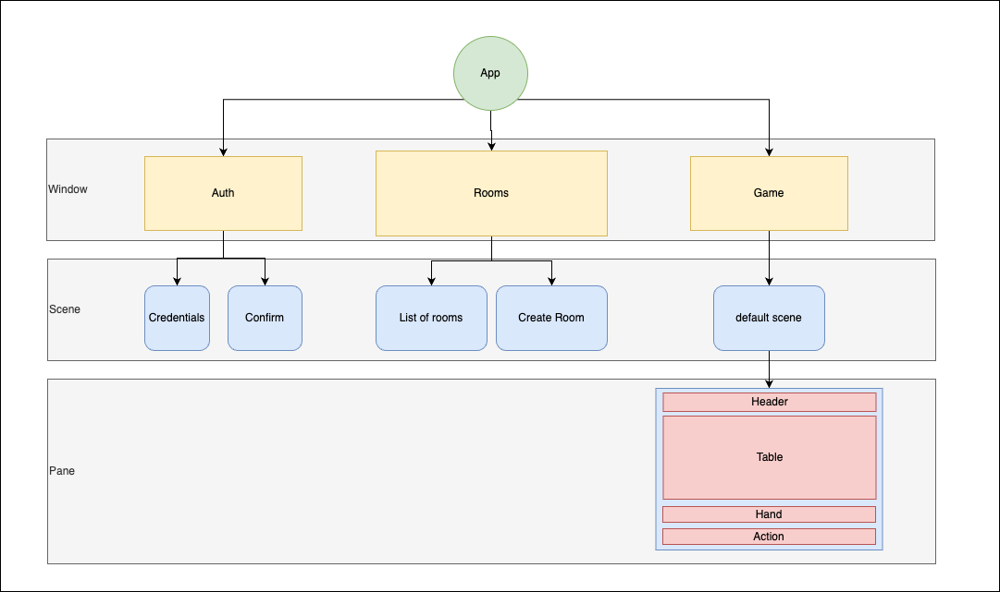
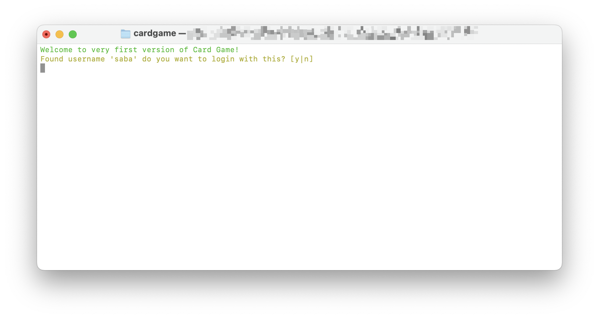
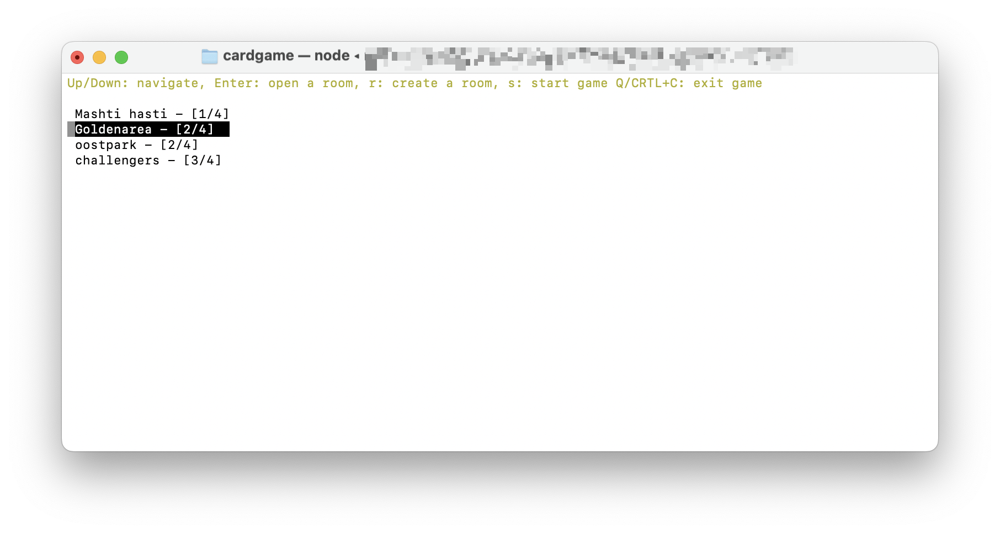
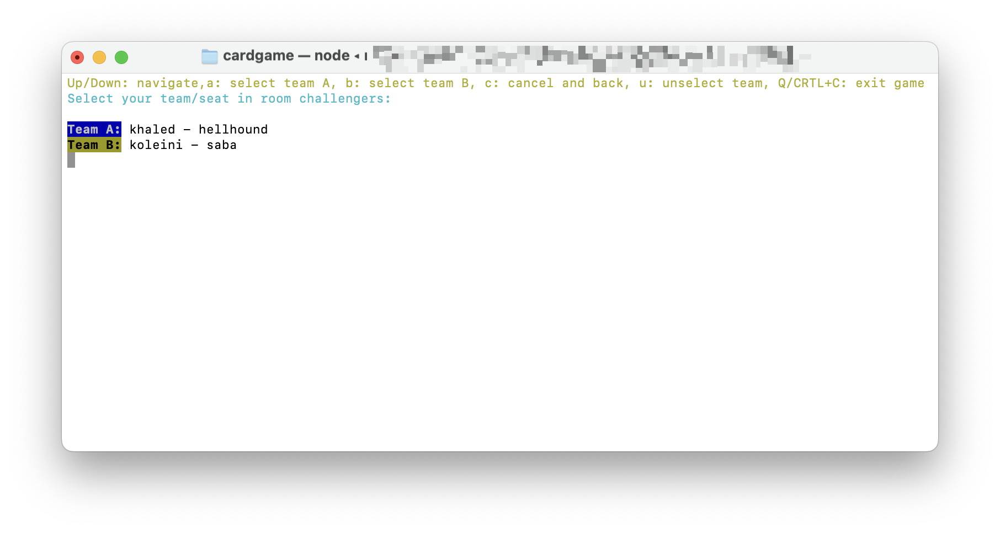
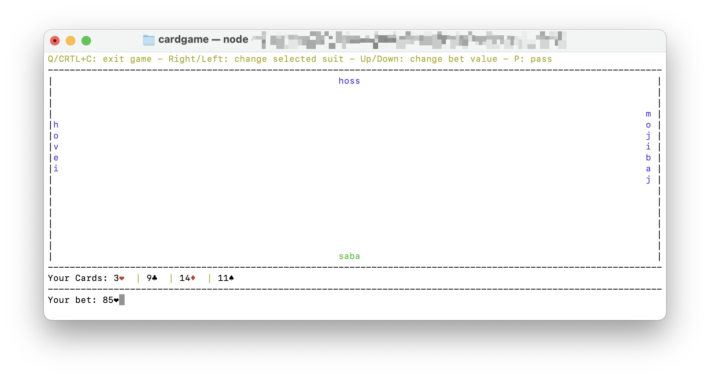

This is an experimental implementation of a four-people card game in TypeScript using terminal-kit.

#### App Cycle:

Coming from a web and mobile background, I tried to apply some of their principles to handle the terminal. For instance, window in this project is similar to Activity on mobile or Page for web applications. Each window can contain several scenes, which represent different stages of a page, and each scene could contain different panes, representing desired areas of a scene.

#### Key Handler:

I decided to separate the handling for key inputs. `app/utils/input.handler.ts` is mainly responsible for inputs. If the pressed key isn't "q" or "ctrl+c", it passes the key to the active window's key handler.

#### Folder Structure:

-   app
    -   windows
        -   [window name]
            -   index.ts (main file) - required
            -   input.handler.ts (window input handler) - optional
            -   mocks.ts - optional
    -   utils (helpers and types)
    -   store
        -   [slice name]
            -   actions.ts
            -   [name]Slice.ts
            -   selectors.ts

#### Screenshots:

